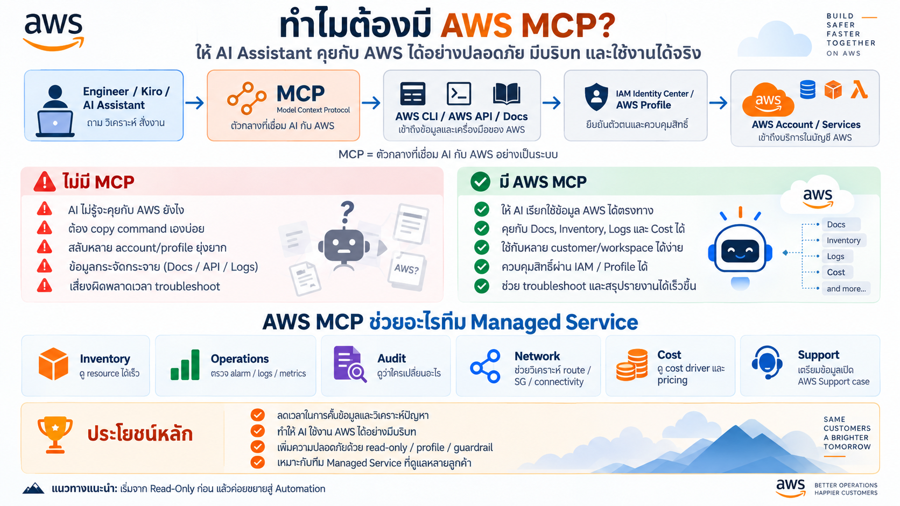

# Kiro + AWS MCP — Managed Service Training

 **Windows + Kiro IDE + AWS MCP**

## Overview




## Training Format

```text
8 Days
1 Hour / Day
10 min Concept
15 min Demo
30 min Hands-on
5 min Review
```

## Tool Stack

```text
Kiro IDE
├── uv / uvx
│   └── Python-based AWS MCP
│
├── npm / npx
│   ├── sample-aws-pricing-calculator-mcp@latest
│   └── @drawio/mcp
│
├── AWS CLI v2
└── AWS IAM Identity Center
```

## Files

| Day | Topic | File |
|---|---|---|
| 1 | Windows Setup + Kiro + uv + npx + MCP | [Day 1](./Day_01_Windows_Setup_Kiro_uv_npx_MCP.md) |
| 2 | AWS Documentation / Knowledge | [Day 2](./Day_02_AWS_Documentation_Knowledge.md) |
| 3 | AWS Inventory + Overview | [Day 3](./Day_03_AWS_Inventory_Overview.md) |
| 4 | CloudWatch Troubleshooting | [Day 4](./Day_04_CloudWatch_Troubleshooting.md) |
| 5 | CloudTrail + IAM Audit | [Day 5](./Day_05_CloudTrail_IAM_Audit.md) |
| 6 | AWS Network + draw.io | [Day 6](./Day_06_AWS_Network_DrawIO.md) |
| 7 | AWS Cost + Pricing Calculator | [Day 7](./Day_07_AWS_Cost_Pricing_Calculator.md) |
| 8 | Full Incident Investigation | [Day 8](./Day_08_Full_Incident_Investigation.md) |

MCP Configuration:

- [mcp.json](./mcp.json)

---

# Windows Prerequisites

## 1. Kiro

```text
https://kiro.dev/downloads/
```

## 2. AWS CLI

ตรวจสอบ:

```powershell
aws --version
```

## 3. uv / uvx

ติดตั้ง:

```powershell
powershell -ExecutionPolicy ByPass -c "irm https://astral.sh/uv/install.ps1 | iex"
```

ตรวจสอบ:

```powershell
uv --version
uvx --version
```

## 4. Node.js + npm + npx

ติดตั้ง Node.js LTS:

```powershell
winget install OpenJS.NodeJS.LTS
```

ตรวจสอบ:

```powershell
node --version
npm --version
npx --version
```

## 5. Test Node-based MCP

AWS Pricing Calculator:

```powershell
npx -y sample-aws-pricing-calculator-mcp@latest
```

draw.io:

```powershell
npx -y @drawio/mcp
```

---

# Workspace Standard

```text
C:\Managed-Service\
├── CUST-A-PROD\
│   └── .kiro\settings\mcp.json
│
├── CUST-B-PROD\
│   └── .kiro\settings\mcp.json
│
└── INTERNAL-LAB\
    └── .kiro\settings\mcp.json
```

หลักการ:

```text
1 Customer
= 1 Workspace
= 1 mcp.json
= 1 AWS Profile
```

เปิด Workspace MCP config ใน Kiro:

```text
Ctrl + Shift + P
→ Kiro: Open workspace MCP config (JSON)
```

---

# MCP Included

| MCP | Runtime | Use |
|---|---|---|
| AWS MCP | uvx | General AWS / knowledge / resource access |
| CloudWatch MCP | uvx | Alarm / Metrics / Logs |
| CloudTrail MCP | uvx | Change Investigation |
| AWS Network MCP | uvx | Network Troubleshooting |
| Billing & Cost MCP | uvx | Actual Cost Analysis |
| AWS Pricing MCP | uvx | Pricing / Unit Price |
| AWS Pricing Calculator MCP | npx | Build shareable AWS Pricing Calculator estimates |
| draw.io MCP | npx | Create editable diagrams |

---

# Why Two Runtimes?

```text
Python-based MCP
→ uvx

Node.js-based MCP
→ npx
```

Examples:

```powershell
uvx awslabs.aws-network-mcp-server@latest
```

```powershell
npx -y sample-aws-pricing-calculator-mcp@latest
```

```powershell
npx -y @drawio/mcp
```

---

# Before Every Session

```powershell
aws sso login --profile customer-a-readonly
```

```powershell
aws sts get-caller-identity --profile customer-a-readonly
```

จากนั้นถาม Kiro:

```text
Verify my AWS Account ID, Role/Profile and Region before doing anything.

READ ONLY.
Do not make changes.
```

---

# Safety Standard

- Read-Only First
- No Auto Approve
- One Workspace per Customer
- One AWS Profile per Customer
- Human Review before Production Change
- AI ต้องแยก Fact / Evidence / Hypothesis
- Diagram ต้องไม่ invent resource ที่ไม่มีอยู่จริง

---

# Recommended Learning Flow

```text
Day 1  Setup
   ↓
Day 2  Knowledge
   ↓
Day 3  Inventory
   ↓
Day 4  Operations
   ↓
Day 5  Audit
   ↓
Day 6  Network + Diagram
   ↓
Day 7  Cost + Pricing Calculator
   ↓
Day 8  Full Incident Workflow
```

---

# References

- AWS Labs MCP: https://github.com/awslabs/mcp
- AWS Pricing Calculator MCP: https://github.com/aws-samples/sample-aws-pricing-calculator-mcp
- draw.io MCP: https://github.com/jgraph/drawio-mcp
- Kiro MCP: https://kiro.dev/docs/mcp/
- Kiro MCP Configuration: https://kiro.dev/docs/mcp/configuration/
